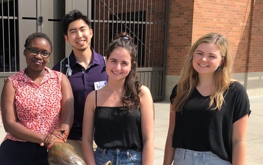

### About

Individual Bios

**Corinne Bintz: Undergraduate Student, Department of Computer Science
Middlebury College:**
Corinne Bintz is an undergraduate student at Middlebury College, majoring in Computer Science and minoring in Global Health. Corinne is interested in using data science and other computational tools for social good, specifically for public and global health purposes. Prior to the University of Washington Data Science for Social Good program, Corinne worked as a software engineer intern for myStrength, a digital behavioral health company in Denver, Colorado where she contributed to mobile and backend development.
Corinne has experience in machine learning and data visualization. She has worked with various nonprofit organizations dedicated to social justice, such as the YWCA and Girls Who Code. Corinne spent the past spring semester in Stockholm, Sweden studying public health in the Swedish and European context. In her free time, Corinne enjoys spending time with friends outdoors in the Pacific Northwest, including hiking, backpacking, climbing, swimming and running.

**Vivian Guetler: Doctoral Student, Department of Sociology & Anthropology
West Virginia University:**
Vivian is a fourth year Ph.D. student in sociology at West Virginia University. As an aspiring computational sociologist and data scientist, Vivian’s research has focused on the integration of technology, computational social sciences and data science through a sociological lens. Her research interests include cyberterrorism, impact of technologies on society, ethical considerations of machine learning algorithms on society, social interactions and network structures.
Her current research analyzes how terrorist groups use technologies and the role of hacktivists in countering terrorist’s social media accounts and websites. In addition, she studies algorithm biases and how they are used in the criminal justice system. Vivian studies these phenomena using qualitative and quantitative methods, network science, natural language processing, machine learning, and exploratory visualization techniques. She has presented her research in annual conferences such as the American Society of Criminology, American Sociological Association, Media Sociology Pre-Conference, Society for Terrorism Research, T2 Conference on Technology and the Future of Terror and Network Science (NetSci).
She is excited for the DSSG opportunity and to be working alongside an interdisciplinary team to help solve society’s problems through data science.

**Daniella Raz: Master’s Student, School of Information
University of Michigan:**
Daniella Raz is a master’s student at the University of Michigan’s School of Information. She holds a bachelor’s degree from the University of Michigan in Political Science and Arabic and Islamic Studies, as well as a minor in Applied Statistics. During her undergraduate studies, Daniella interned at a human rights NGO in Jerusalem, and conducted research for the Rabat Social Studies Institute in Morocco and for the Arab Barometer Project. Using public opinion data collected by Arab Barometer, Daniella wrote her bachelor’s thesis on attitudes toward gender equality in Arab Muslim societies.
Prior to starting graduate school, she interned at Google in Dublin, Ireland. There, she worked with large-scale datasets on several projects, including user experience analysis and ad optimization. At the DSSG program, Daniella is looking forward to combining her previous experiences in policy and data analysis with more recent interests in digital privacy and ethical issues arising from the implementation of artificial intelligence systems.

**Aaron Tam: Master’s Student, Evan’s School of Public Policy and Governance
University of Washington:**
Aaron Tam is currently a master’s student at the Evan’s School of Public Policy and Governance. Aaron received a B.S. in Environmental Science and Resource Management: Wildlife Conservation and a B.A. in Political Science from the University of Washington. Aaron is an artist, activist, scientist, leader, and educator, and he has strong interests in environmental, socioeconomic, and racial justice issues.
Prior to graduate school, Aaron worked as an organizer for the Endangered Species Coalition working with native tribes, farmers, businesses, scientists, and activists to protect southern resident orcas, gray wolves, and the Endangered Species Act. Aaron also worked as a coordinator for Carbon Washington to advocate for Washington state’s first carbon tax initiative (Initiative 732). Aaron now serves as a board member for Carbon Washington helping develop and inform climate policies in Washington state.

During his free time, Aaron enjoys playing racket sports, hiking, powerlifting, and volunteering.

**Mike Katell, Project Lead: Ph.D. Candidate, Information School
University of Washington:**
Mike Katell (he/him) is a Ph.D. Candidate at the UW Information School. His research focus is information policy, law, and ethics. Prior to his Ph.D. study, Mike worked as a technologist supporting and advising organizations working for social justice. His current research focus is algorithmic profiling and decision-making and their implications for vulnerable populations and the distribution social power. Mike is a member of the Critical Platform Studies Group and is affiliated with the Tech Policy Lab and the Value Sensitive Design Lab.

**Peaks Krafft, Faculty Advisor: Senior Research Fellow, Oxford Internet Institute:**
Dr. Krafft is a senior research fellow at the Oxford Internet Institute in the University of Oxford’s Social Science Division. Dr. Krafft’s research, teaching, and organizing aim to bridge computing, the social sciences, and public interest sector work towards the goals of social responsibility and social justice. Dr. Krafft pursues multiple programs toward this end, including basic social science research, policy-facing computer science research, and cross-sector organizing.

**Meg Young, Community Engagement Lead: Ph.D. Candidate, Information School, University of Washington:**
Meg is the community engagement lead for the Algorithmic Equity Toolkit. She is a Ph.D. Candidate in the Information School at the University of Washington in Seattle, where she conducts ethnographic and policy research on accountability in data-intensive systems. In the Tech Policy Lab, she has worked with government employees, community stakeholders, and tech activists on data governance and inclusive policy. She is also a co-director of the Critical Platform Studies Group, a research collective pursuing participatory action research with advocacy organizations. She holds an M.S. in Information Science and a B.A. in Cultural Anthropology from the University of Michigan. You can reach her on Twitter at megyoung0.

**Bernease Herman, Data Science Lead: Data Science Fellow, Research Staff, eScience Institute, University of Washington:**
Bernease Herman joins the eScience Institute as a data scientist. Bernease was most recently a software development engineer at Amazon, where she collaborated with operations research scientists and statisticians to add economic constraints and buying models to Amazon’s Inventory Planning and Control system. Previous to Amazon, Bernease worked on derivatives pricing and predictive modeling at the research arm of Morgan Stanley. Bernease earned her B.S. in Mathematics and Statistics from the University of Michigan.

Roles or Contributions (optional, only if it makes sense to your team)

Where readers can find more details about the project, e.g. code, data, reports, etc.

Acknowledgements
We would like to thank all the sponsors of the DSSG program and our project, including the Alfred P. Sloan Foundation, the Washington Research Foundation, University of Washington eScience Institute, the Gordon and Betty Moore Foundation, the University of Washington Tech Policy Lab, and the Cascadia Urban Analytics Cooperative.

We would also like to thank the stakeholders central to our project, including the American Civil Liberties Union, the Council on American Islamic Relations, and Densho. 
